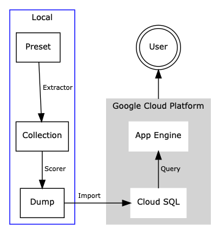

# Nijk
Nijk is for helping programmers come up with good names.
Nijk analyzes some of the most popular projects to suggest good names for given context.

Nijk is named after the common non-meaningful variable names `n`, `i,` `j`, and `k`, to remind
programmers of the importance of good names. It is also easy to pronounce; just like Nick`[nɪk]`.

## Architecture



## Quick Start
Nijk is written with multiple tools and programming languages.
To generate a dump, which is the overall output of the *Local* phase, you will need:
- Python 3.6 or later
- Go 1.11 or later

### Python
The Python dependencies are managed with [Pipenv].
If you are familiar with [Pipenv], you can simply run `pipenv install`.
You can also configure your own [Virtualenv] and just run `pip install -r requirements.txt`.

### Go
Go packages for Nijk is organized with Go Modules, which was introduced in Go 1.11.
Using GO 1.11 or later, there is nothing that you need to do explicitly.

### Compile a collection
To compile a collection, you need to write a preset under the `presets` directory.
For now, there is only a preset for Python, which is `presets/python.txt`.
Of course, it is also possible to write your own preset, like `presets/*.txt`.
Once you are already, run:
```sh
scripts/scripts/compile_collection.py python
```

or simply,

```sh
make collections/python.txt
```

The script will download the source code of the projects specified in the preset, and
extract contexts from them into `collections/python.txt`.

### Analyze and Dump as SQL
Once the collection is compiled, you can run the scorer to analyze the collection.
Run the following command:

```sh
go run ./scorer/cmd 'python' < 'collections/python.txt' > 'dumps/python.sql'
```

or simply,
```sh
make dumps/python.sql
```

The dump data will look like:
```sql
INSERT INTO `python_paradigmatic` VALUES ("encode", "hex_encode", 0.51461);
```

The dump SQL represents, "Based on the analysis of the preset Python, the paradigmatic relation score between `encode` and
 `hex_encode`  is `0.51461`." To import this dump, you need the table definition for this, which is created by
the Go package [scorer/cmd/schema](https://godoc.org/github.com/yeonghoey/nijk/scorer/cmd/schema).

### Cloud SQL and App Engine
Nijk provides the analysis result as a web app, https://nijk-225007.appspot.com.
To make this possible, Nijk is deployed to Google Cloud Platform.

Even though the source code is open-sourced, actually deploying it is private.
For this reason, some configurations have been hard-coded, including the importing script `scripts/import-dump.sh`.

The Cloud SQL service and some permissions related to import the dump file is written in [Terraform], in [infra](infra).
The App Engine app is deployed by directly using Google Cloud SDK.

## Presets
A preset is basically a list of projects to be used as ideal naming examples.
It is also the basic analysis unit of Nijk.
Based on a preset, Nijk extracts identifiers from source code in projects listed, to compose a collection of contexts.

For more details, see [presets](presets).

## Extractors
An extractor is responsible for extracting contexts from a project.
Currently, Nijk supports [Python](extractors/py/run) only.


For more details, see [extractors](extractors).

## Collection
[scripts/compile_collection.py](scripts/compile_collection.py) first downloads projects specified in a preset.
And then, it executes extractors on those projects. Finally, it concatenates the outputs of the executions. 

For more details, see [collections](collections).

## Scorer
Scorer is the core of Nijk. It reads a collection and run Paradigmatic and Syntagmatic Relation Discovery algorithm based on normalized-[BM25](https://en.wikipedia.org/wiki/Okapi_BM25).
Scorer is implemented in Go. It also has a command-line interface which generates SQL dump queries to be imported to a MySQL server.

For more details, see [package scorer](https://godoc.org/github.com/yeonghoey/nijk/scorer).

## Google Cloud Platform
As mentioned before, the web app Nijk is deployed on Google Cloud Platform (GCP).
Though some configurations hare hard-coded and you cannot deploy it yourself as it is,
since I tried to do all the infrastructure settings as code, you can check almost every detail of the setup.

For the database, Cloud SQL, all the configurations are written in Terraform code, in [infra/main.tf](infra/main.tf).
You can also check [app.go](app.go) and [app.yaml](app.yaml) for the details of the App Engine web application.

In most cases, To deploy Nijk, I simply run following commands to deploy Nijk:

```sh
# To update the DB with newly generated 'dumps/python.sql'
scripts/import-dump.sh 'python'

# To run the dev server of the web app
make dev

# To deploy the web app
make deploy
```

## Caveat

This is my(yeongho2@illinois.edu) course project for
Text Information Systems of [MCS-DS](https://cs.illinois.edu/academics/graduate/professional-mcs-program/online-master-computer-science-data-science).


[Pipenv]: https://pipenv.readthedocs.io/en/latest/.
[Virtualenv]: https://virtualenv.pypa.io/en/latest/
[Terraform]: http://terraform.io
